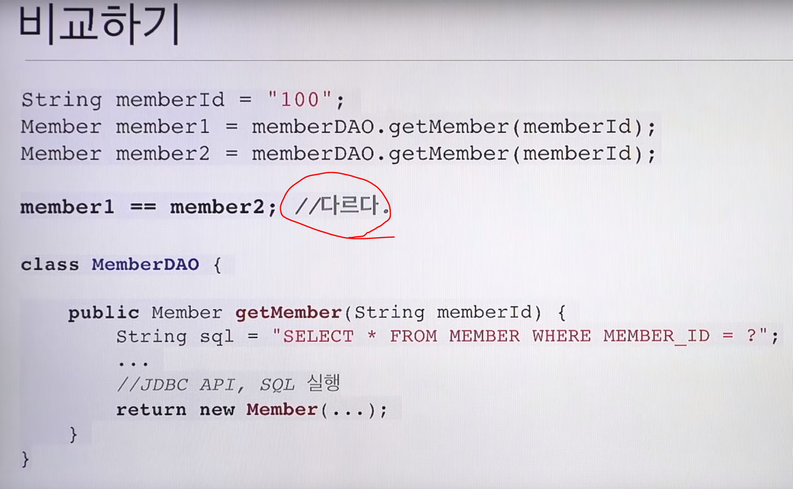
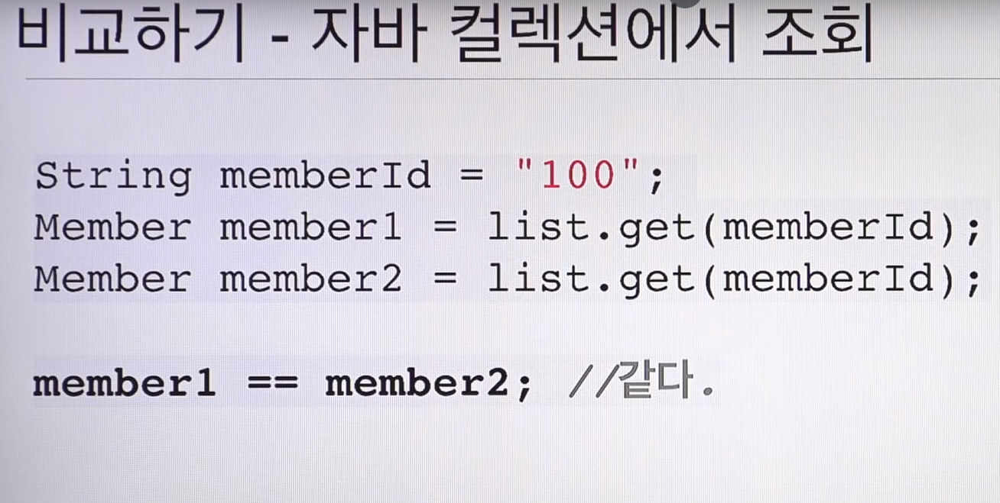
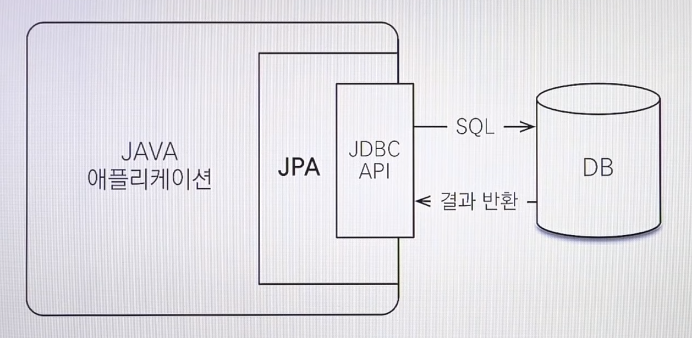
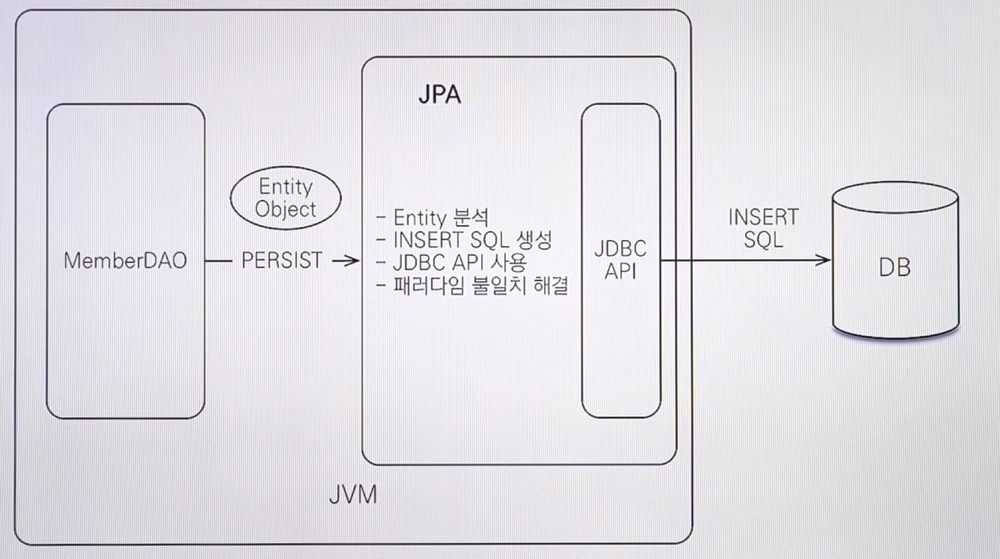
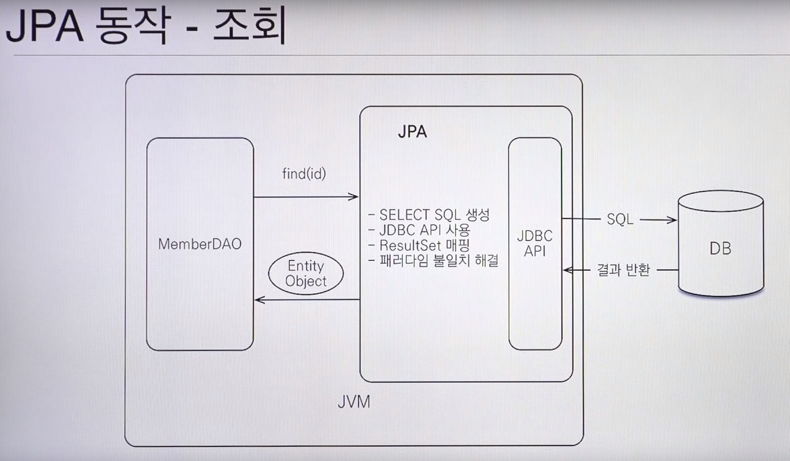
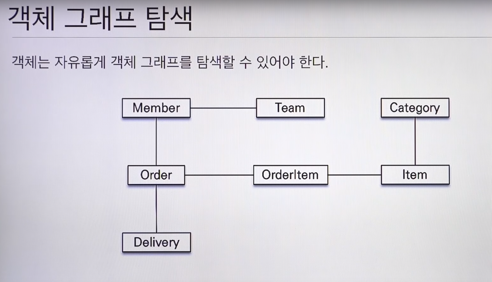

# [1. JPA 기초와 매핑](https://www.youtube.com/watch?v=WfrSN9Z7MiA&index=1&list=PL9mhQYIlKEhfpMVndI23RwWTL9-VL-B7U)

# JPA란

## JPA의 필요성

- 객체답게 모델링 할수록 매핑작업만 늘어난다. (SQL 의존적인 개발을 피하기 어려움)
  - 객체를 SQL로 변경하면서 많은 리소스를 낭비한다!
  - 개발자 ≒ SQL 매퍼 수준!
- 패러다임의 불일치
  - 객체지향과 관계형 데이터베이스는 나온 사상이 다름
    - 관계형 데이터베이스 - 객체를 어떻게 정규화해서 저장을 할까!
    - 객체지향 - 어떻게 추상화하고 관리를 잘 할까?
  - 객체와 RDB의 차이
    - 상속
    - 연관관계
      - 객체는 **참조** 사용 : member.getTeam()
      - RDB는 **외래키** 사용 : JOIN ....
    - 데이터 타입
    - 데이터 식별 방법

##  객체를 자바 컬렉션에 저장하듯이 DB에 저장할 수는 없을까?  

-> **Java Persistence API** (영구저장 API!)
 : 자바 진영의 ORM 표준
- 이건 스펙이므로 껍데기만 있음
- 구현한 것이 하이버네이트

## ORM?

- 객체는 **객체답게** 설계
- RDB는 **RDB답게** 설계
- 중간에서 **매핑은 ORM 프레임워크**가!
- 그렇게 **JPA** 탄생!
  - 구현체 종류
    - **Hibernate** (오픈소스)
    - EclipseLink
    - DataNucleaus
    - etc..

## JPA의 구조

## 정리

- 왜 JPA를 사용해야 하는가?
  - SQL 중심적인 개발에서 객체 중심으로 개발
  - 생산성
    - C : jpa.persist(member);
    - R : Member member = jpa.find(memberId);
    - U : member.setName("양희찬");
    - D : jpa.remove(member);
  - 유지보수
  - 패러다임의 불일치 해결
  - 성능
    - 1차 캐시
    - Lazy loading & Eager Loading
    - N+1문제도 세팅을 통해 해결 가능
    - 트랜잭션을 지원하는 쓰기 지연 - Insert
      - 모았다가 커밋하는 순간에 한 번에 네트워크를 탐!
  - 데이터 접근 추상화와 벤더 독립성
  - 표준