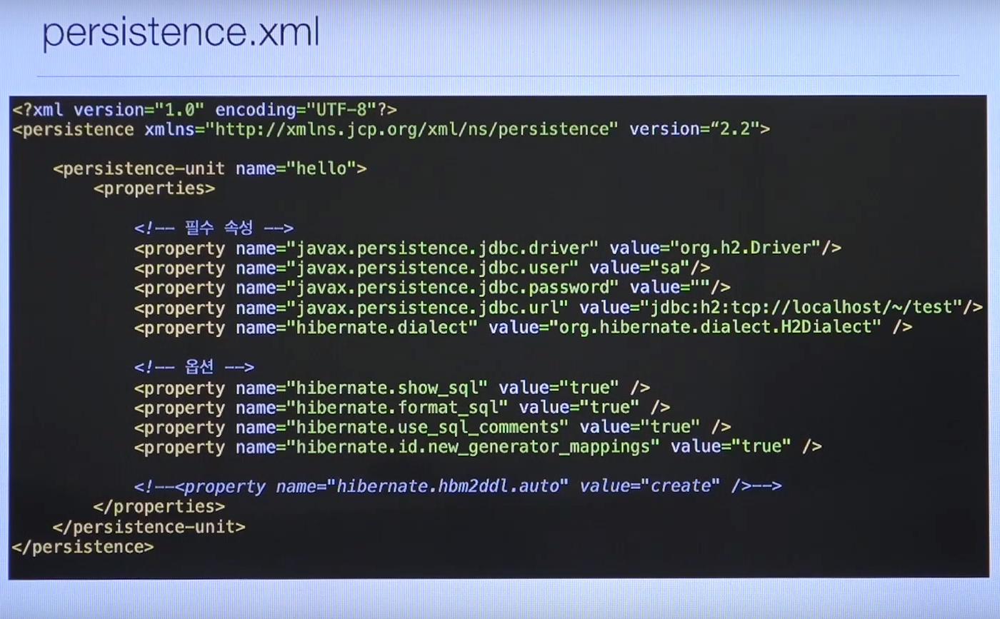
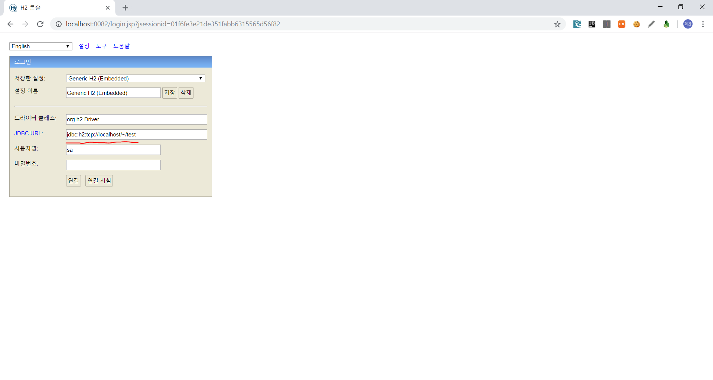
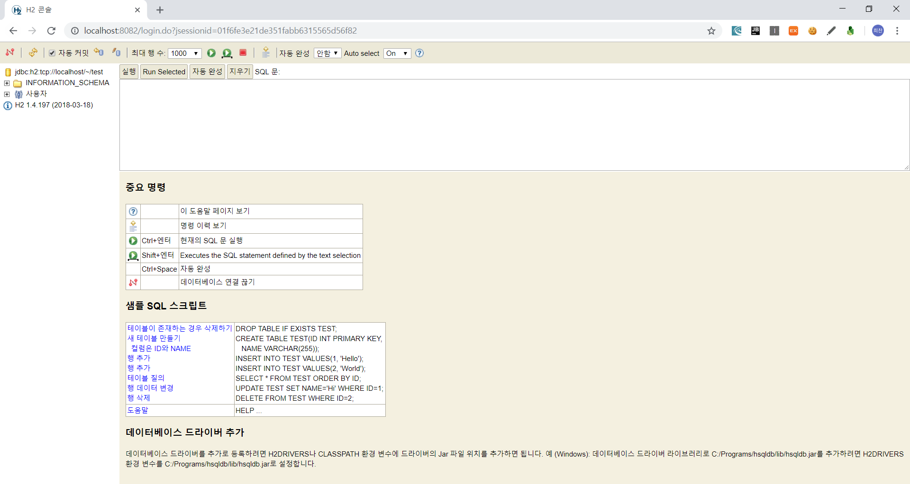
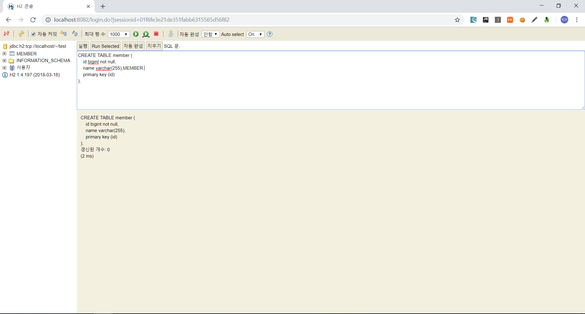
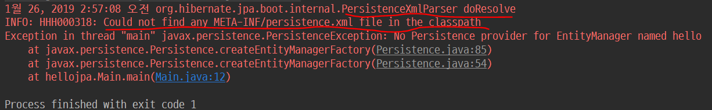
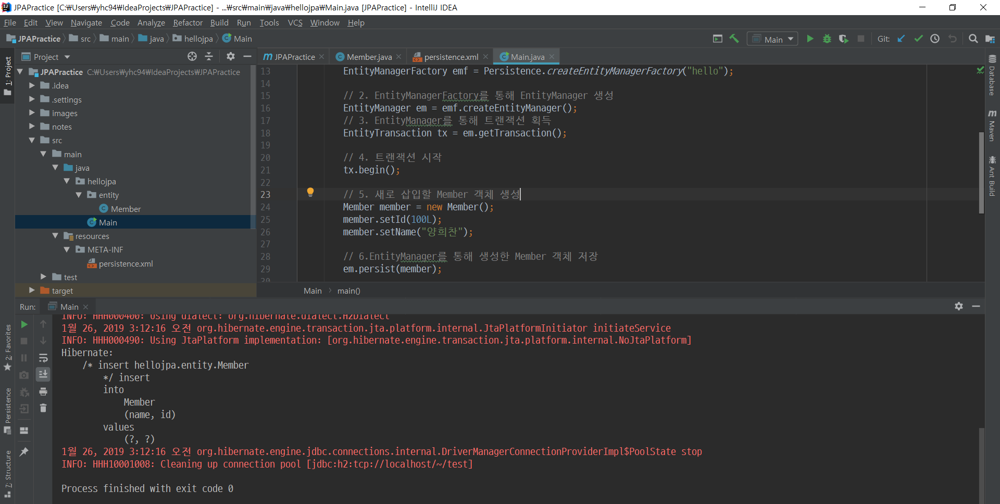

# JPA 기초와 매핑

## H2 DB

### H2 DB란?

H2 DB란 In-Memory 기반 데이터베이스의 일종.

### H2 DB 장점

- 최고의 실습용 DB (현업에 쓰기엔 좀 그럼)
- 가볍다
- 웹용 쿼리툴 제공
- MySQL, Oracle DB 시뮬레이션 가능
- 시퀀스, Auto Increment 기능 지원

## JPA Annotation

- @Entity : JPA가 관리할 객체
- @Id : DB PK와 매핑할 필드
- ex) 
```java
@Entity
public class Member{

    @Id
    private Long id;
    private String name;
    ...
}
```

```sql
CREATE TABLE member (
    id bigint not null,
    name varchar(255),
    ...
    primary key (id)
);
```

## persistence.xml

- JPA 설정 파일
- 경로 : /META-INF/persistence.xml
- javax.persistence로 시작: JPA 표준 속성
- hibernate로 시작 : Hibernate 전용 속성


### dialect? 데이터베이스 방언!

- `JPA`는 특정 DB에 종속적이지 않은 기술!
  - 하지만 DB 사정은 다르다! 벤더마다 조금씩 다름
    - `MySQL` - `VARCHAR` / `Oracle` - `VARCHAR2`
    - `MySQL` - `LIMIT` / `Oracle` - `ROWNUM`
- hibernate.dialect
  - H2 (org.hibernate.dialect.H2Dialect)
  - Oracle 10g (org.hibernate.dialect.Oracle10gDialect)
  - MySQL (org.hibernate.dialect.MySQL5InnoDBDialect)
  - etc...

# 실습

## 1. H2 Database 설치

- [다운로드 페이지](http://www.h2database.com/html/download.html)

## 2. H2 Database 실행 후 접속 확인

1. H2 Console.exe를 찾은 후 실행
2. 인터넷 브라우저 주소창에서 localhost의 8082 포트로 접속 ([localhost:8082](localhost:8082))
3. member 테이블 생성

```sql
CREATE TABLE member (
    id bigint not null,
    name varchar(255),
    primary key (id)
);
```



<center> [그림 1-1] H2 로그인 </center>



<center> [그림 1-2] H2 로그인 결과 </center>



<center> [그림 1-3] member 테이블 생성 </center>

## 3. Maven 프로젝트 생성

## 4. Dependency 추가

pom.xml에 다음과 같이 dependency를 추가해준다.

```mvn
    <dependencies>

        <!-- Hibernate -->
        <dependency>
            <groupId>org.hibernate</groupId>
            <artifactId>hibernate-entitymanager</artifactId>
            <version>5.4.0.Final</version>
        </dependency>

        <!-- H2 Database -->
        <dependency>
            <groupId>com.h2database</groupId>
            <artifactId>h2</artifactId>
            <version>1.4.197</version>
            <!-- <scope>test</scope> -->
        </dependency>

    </dependencies>
```

## 5. JPA 설정 파일 생성

resources/META-INF/persistence.xml

```xml
<?xml version="1.0" encoding="UTF-8"?>
<persistence xmlns="http://xmlns.jcp.org/xml/ns/persistence" version="2.2">
    <persistence-unit name="hello">
        <properties>

            <!-- 필수 속성 -->
            <property name="javax.persistence.jdbc.driver" value="org.h2.Driver"/>
            <property name="javax.persistence.jdbc.user" value="sa"/>
            <property name="javax.persistence.jdbc.password" value=""/>
            <property name="javax.persistence.jdbc.url" value="jdbc:h2:tcp://localhost/~/test"/>
            <property name="hibernate.dialect" value="org.hibernate.dialect.H2Dialect"/>

            <!-- 선택 속성 -->
            <property name="hibernate.show_sql" value="true"/>
            <property name="hibernate.format_sql" value="true"/>
            <property name="hibernate.use_sql_comments" value="true"/>


        </properties>
    </persistence-unit>
</persistence>
```

\* 만약 경로가 다르면 실행 시 다음과 같은 에러가 발생함


<center> [그림 2] persistence.xml 경로 에러</center>

## 6. Member class 생성

```java
package hellojpa.entity;

import javax.persistence.Entity;
import javax.persistence.Id;

@Entity // JPA의 객체이다!
public class Member {

    @Id // PK값이다!
    private Long id;
    private String name;

    public Long getId() {
        return id;
    }

    public void setId(Long id) {
        this.id = id;
    }

    public String getName() {
        return name;
    }

    public void setName(String name) {
        this.name = name;
    }
}

```

## 7. Main class 및 method 생성

```java
package hellojpa;

import hellojpa.entity.Member;

import javax.persistence.EntityManager;
import javax.persistence.EntityManagerFactory;
import javax.persistence.EntityTransaction;
import javax.persistence.Persistence;

public class Main {
    public static void main(String[] args) {
        // 1. EntityManagerFactory 생성
        EntityManagerFactory emf = Persistence.createEntityManagerFactory("hello");

        // 2. EntityManagerFactory를 통해 EntityManager 생성
        EntityManager em = emf.createEntityManager();
        // 3. EntityManager를 통해 트랜잭션 획득
        EntityTransaction tx = em.getTransaction();

        // 4. 트랜잭션 시작
        tx.begin();

        // 5. 새로 삽입할 Member 객체 생성
        Member member = new Member();
        member.setId(100L);
        member.setName("양희찬");

        // 6.EntityManager를 통해 생성한 Member 객체 저장
        em.persist(member);

        // 7. 트랜잭션 커밋
        tx.commit();

        // 8. EntityManagerFactory 및 EntityManager 종료
        em.close();
        emf.close();
    }
}
```

## 8. 실행 (Alt + Shift + F10)



<center> [그림 3] 실행 후 </center>

# 더 알아보기

- 프로젝트 관리 툴
  - 종류
    - Ant
    - Maven
    - **Gradle**
  - 라이브러리, 빌드 관리
  - 라이브러리 자동 다운로드 및 의존성 관리
  - 예전엔 직접 다운받고 의존성 관리하고 했지만 이런 것들을 자동화!