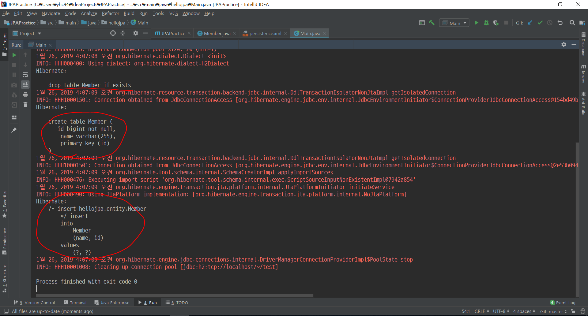
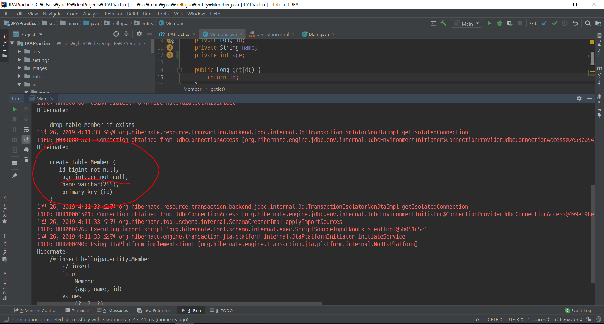
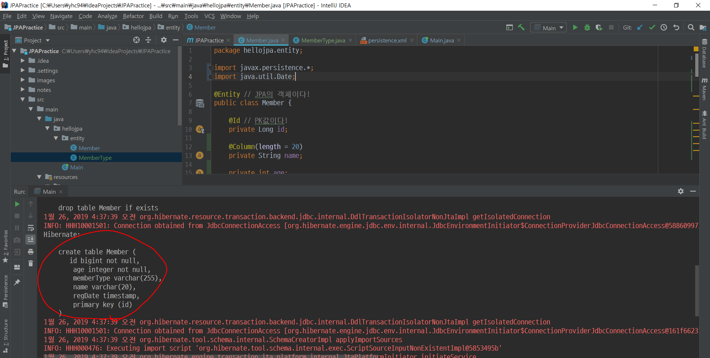
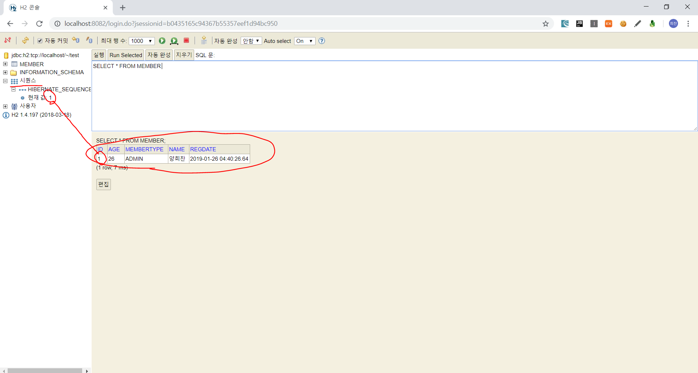

# [3. 필드와 컬럼 매핑](https://www.youtube.com/watch?v=TYO42hpPLq4&list=PL9mhQYIlKEhfpMVndI23RwWTL9-VL-B7U&index=3)

# 데이터베이스 스키마 자동으로 생성하기

- DDL을 애플리케이션 실행 시 자동으로 생성
- 테이블 중심 -> 객체 중심
- 이렇게 생성된 DDL은 **개발 장비에서만** 사용 (운영에서 **절대!!**하면 안됨)

## hibernate.hbm2ddl.auto

- `create` : DROP + CREATE
- `create-drop` : DROP + CREATE + DROP
- `update` : 변경분만 반영
- `validate` : 엔티티와 테이블이 정상매핑 되었는지만 확인
- `none` : 사용하지 않음

### 주의!!

**운영 장비**에선 절대 `create`, `create-drop`, `update` 사용하면 안됨!!!
- 개발 초기 : `create` or `update`
- 테스트 서버 : `update` or `validate`
- 스테이징과 운영서버 : `validate` or `none`

## 매핑 Annotation

- @Column : class의 필드명과 DB의 컬럼명이 일치하지 않을 경우 사용
  - 속성
    - name
    - insertable
    - updatable
    - nullable (DDL 생성 시 사용)
    - unique (DDL 생성 시 사용)
    - length
  - ex)
    ```java
    @Column(name = "USERNAME")
    private String name;
    ```
- @Temporal : 시간 관련
  - ex)
    ```java
    @Temporal(TemporalType.TIMESTAMP)
    private Date regDate;
    ```
- @Enumerated : Enum 타입을 사용할 때
  - ex)
    ```java
    // 현업에선 무조건 STRING으로 써야 함
    @Enumerated(EnumType.STRING)
    private MemberType memberType;
    ```
- @Lob
  - CLOB (Character LOB)
  - BLOB (Byte LOB)
- @Transient
  - 이 필드는 매핑하지 않는다
  - 어플리케이션에선 사용하지만 DB에 저장하진 않는 필드
  - 웬만하면 쓰진 말자

## 식별자 Annotation

- @Id
- @GenerateValue
  - 옵션
    - AUTO : IDENTITY, SEQUENCE, TABLE 중 Dialect에 맞는 방식으로 자동 적용
    - IDENTITY : Database에 위임 (MySQL)
    - SEQUENCE : Sequence Object 사용 (Oracle)
    - TABLE : 키 생성용 테이블 사용 (모든 DB)
  - MySQL의 AutoIncrement
  - Oracle의 Sequence

### 권장하는 식별자 전략

- 기본키 제약조건 
  - Not Null
  - Unique
  - 불변
- 미래까지 이 조건을 만족하는 자연키는 찾기 힘듦
  - 대체키를 사용하자!
  - 예를 들어 주민등록번호도 기본키로 사용하기 어려움!
- 권장 : Long + 대체키 + 키 생성전략 사용
  - Int type ㄴㄴ! Long type ㄱㄱ!
  - or UUID 사용! -> But, 성능 문제는 확인해보고 사용

# 실습 1. 스키마 자동 생성

## 1. persistence.xml에 다음 설정 추가

```xml
<property name="hibernate.hbm2ddl.auto" value="create"/>
```

## 2. 전에 작성한 코드 실행



전에는 재실행하면 Exception이 발생했었지만, 지금은 DROP 후 CREATE을 해주기 때문에 Exception이 발생하지 않는 것과, CREATE TABLE ...의 SQL이 실행되는 것을 볼 수 있다.

## 3. Member class에 age 필드를 추가해보자!

```java
@Entity // JPA의 객체이다!
public class Member {

    @Id // PK값이다!
    private Long id;
    private String name;
    // age 값 추가
    private int age;
    ....
```

## 4. 다시 실행



새로 생성되는 Member 테이블에 age 컬럼이 추가된 것을 볼 수 있다.

# 실습 2. 여러 Annotation 사용해기

## 1. 위에 작성한 여러 Annotation들을 사용해보자

```java
// 수정한 Member class
import javax.persistence.*;
import java.util.Date;

@Entity // JPA의 객체이다!
public class Member {

    @Id // PK값이다!
    @GeneratedValue(strategy = GenerationType.AUTO) // 키 자동 생성
    private Long id;

    @Column(length = 20)
    private String name;

    private int age;

    @Temporal(TemporalType.TIMESTAMP)
    private Date regDate;

    // 현업에선 무조건 STRING으로 써야 함
    // ORDINAL 썼을 경우 인덱스가 들어감 (0, 1, ..)
    // 기본값은 ORDINAL
    @Enumerated(EnumType.STRING)
    private MemberType memberType;

    ...
    // getter/setter
}
```

```java
// 수정한 Main Class & method
package hellojpa;

import hellojpa.entity.Member;
import hellojpa.entity.MemberType;

import javax.persistence.EntityManager;
import javax.persistence.EntityManagerFactory;
import javax.persistence.EntityTransaction;
import javax.persistence.Persistence;
import java.util.Date;

public class Main {
    public static void main(String[] args) {
        // 1. EntityManagerFactory 생성
        EntityManagerFactory emf = Persistence.createEntityManagerFactory("hello");

        // 2. EntityManagerFactory를 통해 EntityManager 생성
        EntityManager em = emf.createEntityManager();
        // 3. EntityManager를 통해 트랜잭션 획득
        EntityTransaction tx = em.getTransaction();

        // 4. 트랜잭션 시작
        tx.begin();

        // 에러 났을 경우를 대비해 try-catch로 처리
        try {
            // 5. 새로 삽입할 Member 객체 생성
            Member member = new Member();
//            member.setId(100L);
            member.setName("양희찬");
            member.setAge(26);
            member.setRegDate(new Date());
            member.setMemberType(MemberType.ADMIN);

            // 6.EntityManager를 통해 생성한 Member 객체 저장
            em.persist(member);

            // 7. 트랜잭션 커밋
            tx.commit();
        } catch (Exception e) {
            // 8. 실패하면 롤백!
            tx.rollback();
        } finally {
            // 9. EntityManagerFactory 및 EntityManager 종료
            em.close();
            emf.close();
        }
    }
}
```

## 2. 실행해보자

다음과 같이 설정해준대로 DDL이 변경된 것을 볼 수 있다




# 더 알아보자
