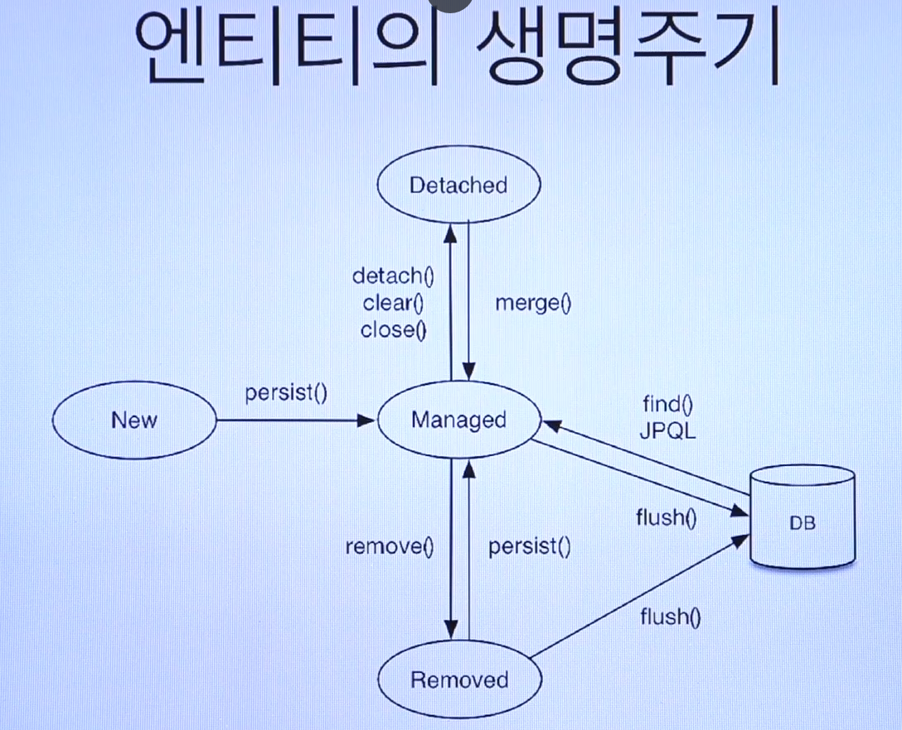

# [6. JPA 내부구조](https://www.youtube.com/watch?v=bEtTpCviSc4&list=PL9mhQYIlKEhfpMVndI23RwWTL9-VL-B7U&index=6)

[EntityManagerFactory & Entitymanager]

# 영속성 컨텍스트

## 영속성 컨텍스트(PersistenceContext)란? 

- **"엔티티를 영구 저장하는 환경"**
- JPA를 이해하는데 가장 중요한 용어!
- 논리적인 개념

## 그럼 영속성 컨텍스트는 왜 있지? 장점은 뭐지?

- 1차 캐시
  - find 했을 때 DB 가기 전에 캐시를 먼저 조회
- 동일성(identity) 보장
- 트랜잭션을 지원하는 쓰기 지연 (Transactional write-behind)
- 변경 감지 (Dirty Checking)
- 지연 로딩 (Lazy Loading)

## 엔티티 생명주기

## Flush

- 영속성 컨텍스트의 변경내용을 DB에 반영
- 하는 일
  - 변경 감지
  - 수정된 엔티티 쓰기 지연 SQL 저장소에 등록
  - 쓰기 지연 SQL 저장소의 쿼리를 데이터베이스에 전송(등록, 수정, 삭제 쿼리)
- 하는 법
  - 직접 호출
    - em.flush()
  - 자동호출
    - 트랜잭션 커밋
    - JPQL 쿼리 실행

# 프록시와 즉시로딩, 지연로딩

- Member를 조회할 때 굳이 Team도 조회해야할까?
  - Proxy 객체라는 가짜객체가 우선 들어감

## 프록시와 즉시로딩 주의

- 가급적 지연 로딩을 사용
- 즉시 로딩을 적용하면 예상하지 못한 SQL이 발생
- 즉시 로딩은 JQPL에서 N+1문제를 발생시킨다
- @ManyToOne, @OneToOne은 즉시 로딩이 Default값
  - 지연 로딩으로 세팅해주자!
- @OneToMany, @ManyToMany는 지연로딩이 Default값
- **LazyInitializationException**
  - 이 에러 많이 볼 것임
  - EntityManager를 close()한 후 지연로딩을 했을 경우 발생!
  - 영속성 컨텍스트에 관리되지 않는 상태여서
    - 영속성 컨텍스트가 DB 커넥션을 가지고 있기 때문