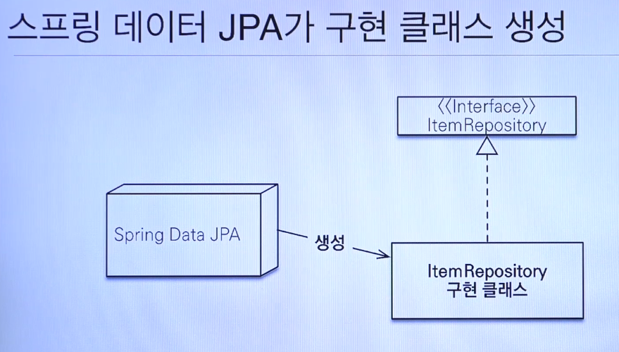
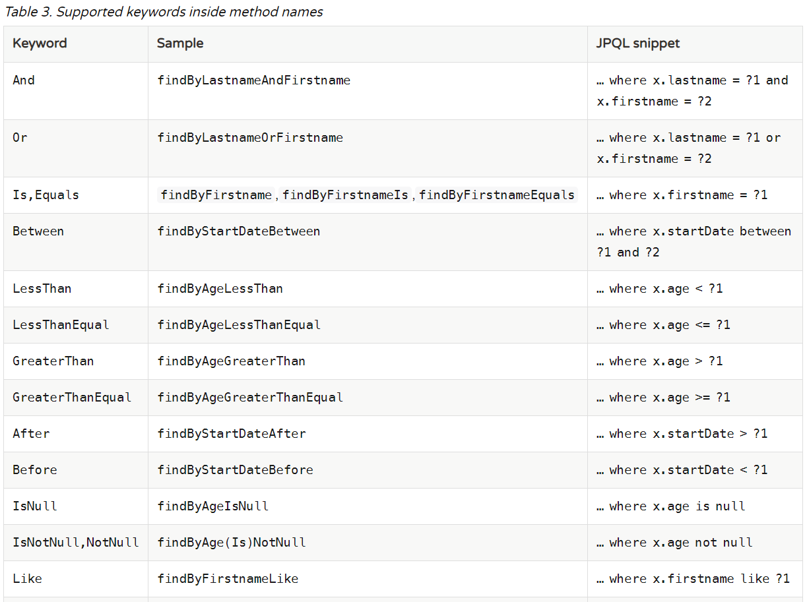
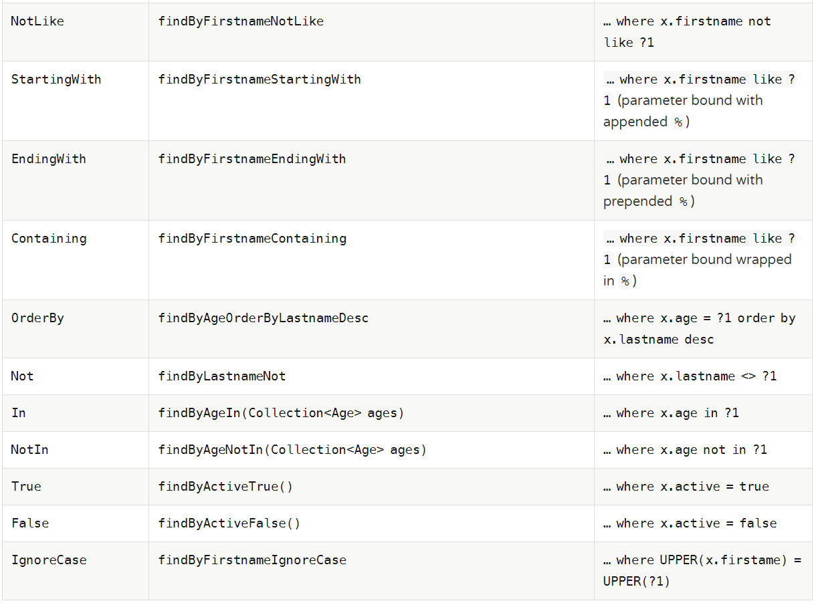
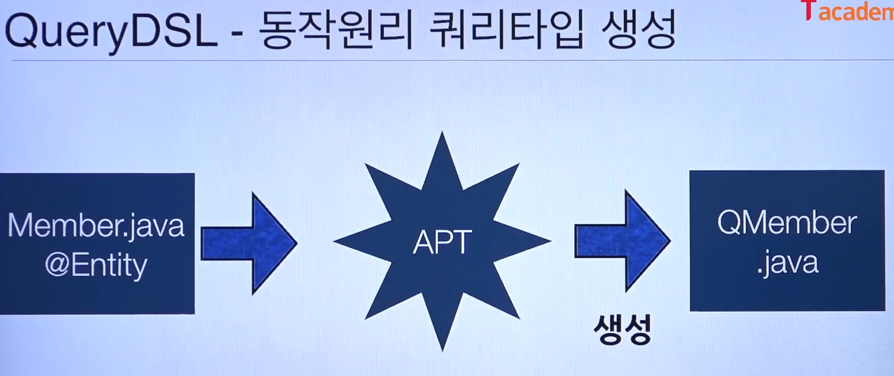
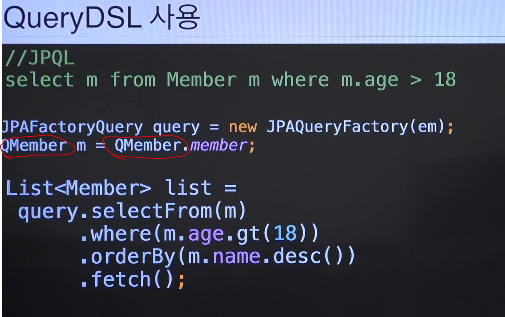

# [8. Spring Data JPA와 QueryDSL 이해](https://www.youtube.com/watch?v=bEtTpCviSc4&list=PL9mhQYIlKEhfpMVndI23RwWTL9-VL-B7U&index=8)

# Spring Data JPA

## 반복되는 CRUD

- 지루하게 반복되는 CRUD를 세련되게 해결
  - save
  - findOne
  - findAll
  - findByUserName
  - etc...
- 개발자는 인터페이스만 작성
- Spring Data JPA가 구현 객체를 동적으로 생성해서 주입
  ```java 
  public interface MemberRepository extends JpaRepository<Member, Long>{ ... }
  ```


## 메서드 이름으로 JPQL 쿼리 생성

- ex) findByUsername



### + 정렬

- ex) List<Member> findByUserName(String userName, **Sort sort**);

### + 정렬 + 페이징

- ex) Page<Member> findByUserName(String userName, Pageable pageable);


### + 정렬 + 페이징 + @Query

```java
@Query("SELECT m FROM Member m WHERE m.user_name = :username")
// @Query("SELECT m FROM Member m WHERE m.user_name = ?1")
public Member findByUsername(String userName, Pageable pageable)
```

### Web 페이징과 정렬 기능

```/members?page=0&size=20&sort=name,desc```

```java
@GetMapping(value = "/members")
String list(Pageable pageable, Model model) { }
```

# QueryDSL

- SQL, JPQL을 코드로 작성할 수 있도록 도와주는 빌더 API
- 더이상 쿼리때문에 장애나고.. 더는 안되겠다!
  - **컴파일 시점**에서 type-check를 어떻게 잡아볼까?!
    - 문자가 아닌 **코드**로 작성
- 동적 쿼리
- 단, 초기 환경설정이 귀찮을 수 있음
  - Gradle 또는 Maven을 엮어서 코드 제너레이트를 해야함

## SQL, JPQL의 문제점

- SQL, JPQL은 문자, Type-check 불가능
  - 해당 로직이 실행되기 전까지 작동여부 확인 불가
    - 잘 해봐야 Application 로딩 시점에야 알 수 있음




# 더 알아보자

- @PostConstructor?
  - Spring 뜰 때 실행?